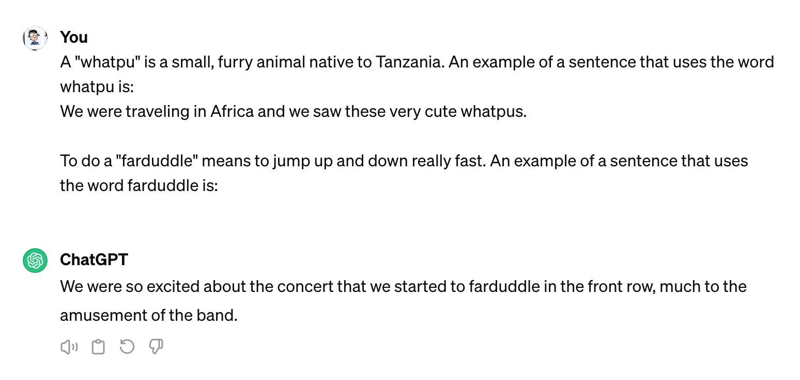
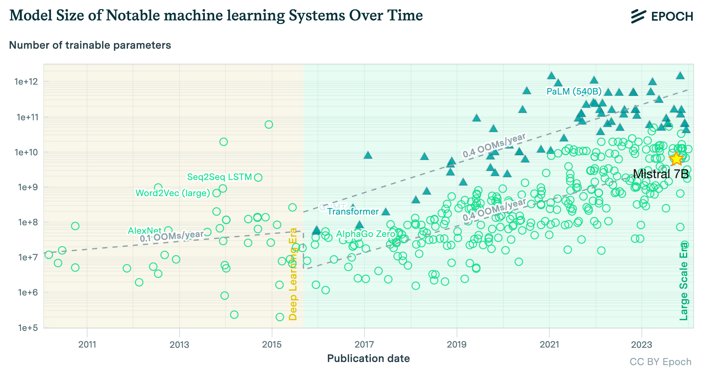
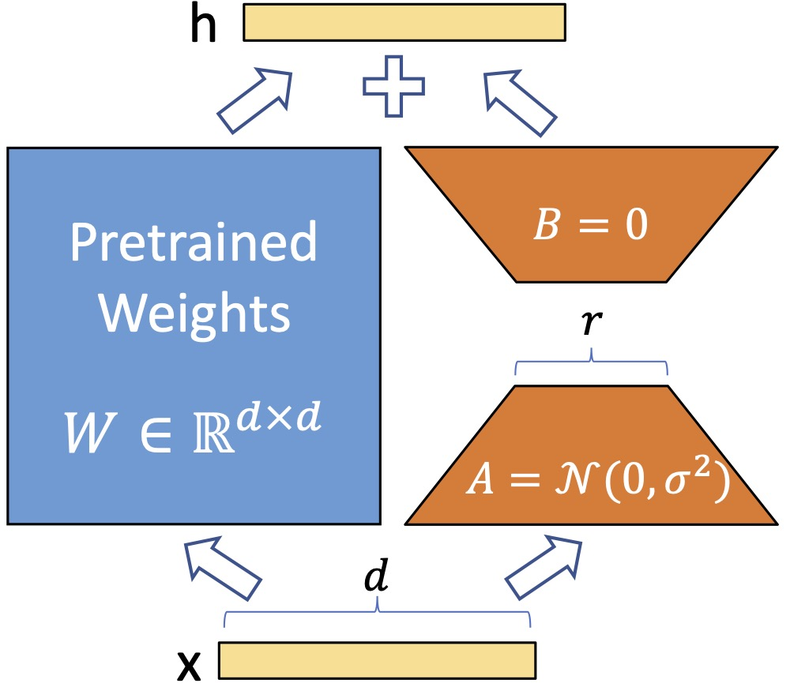
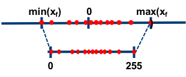

# Fine-tuning d'un LLM

---

## Présentation

- Personnaliser un LLM
- Comment fine-tuner ?
- Travaux pratiques 🛠
- Références

---

## Personnaliser un LLM

- Prompt Engineering
- Retrieval-Augmented Generation (RAG)
- Fine-tuning
- Full training

<!-- Utiliser un RAG est très efficace. -->

<!-- Le fine-tuning n'est pas souvent la solution. -->
<!-- https://www.tidepool.so/blog/why-you-probably-dont-need-to-fine-tune-an-llm -->

---

### Prompt engineering

---

### Retrieval-Augmented Generation (RAG)

---

## Comment fine-tuner ?

On part avec :
- un **LLM**
- un **dataset** spécifique à notre domaine ou tâche
- une méthode d'**évaluation**

---

<!-- https://arxiv.org/abs/1706.03762 -->

---

## Qu'est-ce qu'on modifie ?

LLama 7B, 13B, 70B c'est :

7 000 000 000
13 000 000 000
70 000 000 000

paramètres !

---

<!-- Epoch, ‘Parameter, Compute and Data Trends in Machine Learning’. Published online at epochai.org. Retrieved from: https://epochai.org/data/epochdb/visualization -->

---

## ML CO2 Impact
#### *Quantifying the Carbon Emissions of Machine Learning*

https://mlco2.github.io/impact

---

## Apprentissage

L'apprentissage d'un LLM est très coûteux :
- Calcul (FLOPS)
- [Mémoire](https://huggingface.co/spaces/hf-accelerate/model-memory-usage)

# :dollar:

---

## PEFT !

#### Parameter Efficient Fine-Tuning
- méthodes sélectives
- méthodes de reparamétrisation (LoRA)
- méthodes additives

---

## LoRA: Low-Rank Adaptation

---

## Quantification (1/2)

<!-- https://blogs.nvidia.com/blog/tensorfloat-32-precision-format/ -->

---

## Quantification (2/2)

<!-- https://intellabs.github.io/distiller/algo_quantization.html -->

---

### Méthodes d'alignement

- Reinforcement Learning by Human Feedback (RLHF)
- Direct Preference Optimization (DPO)

---

# TP 🛠

[Notebook de fine-tuning](https://github.com/kuhess/datapero-finetuning-llm/blob/main/notebooks/finetuning_metropole.ipynb)
[Supervision du fine-tuning](https://wandb.ai/qsuire/sft-hermes-2-pro-mistral-7b-metropole)
[Notebook d'inférence](https://github.com/kuhess/datapero-finetuning-llm/blob/main/notebooks/inference_metropole.ipynb) ([vanilla](https://github.com/kuhess/datapero-finetuning-llm/blob/main/notebooks/inference_vanilla.ipynb))
<!-- Générateur de données -->

---

## Références

---

### Ressources

- [Cours de NLP de Hugging Face](https://huggingface.co/learn/nlp-course/chapter3/1)
- [Article de Maxime Labonne](https://mlabonne.github.io/blog/posts/Fine_Tune_Your_Own_Llama_2_Model_in_a_Colab_Notebook.html)
- [Article de HelixML](https://helixml.substack.com/p/how-we-got-fine-tuning-mistral-7b)
- [Explication de la quantification](https://huggingface.co/blog/hf-bitsandbytes-integration)

---

## Outils

### Infra
- Google Colab
- GPU dédié sur runpod.io
- Inference sur octoai.cloud

---

### Librairies

- Apprentissage & inférence
  - [Hugging Face libs](https://github.com/huggingface)
  - [Unsloth](https://github.com/unslothai/unsloth)
- Supervision de l'apprentissage
  - [Weights and Biases (wandb)](https://wandb.ai/capecape/alpaca_ft/reports/How-to-Fine-tune-an-LLM-Part-3-The-HuggingFace-Trainer--Vmlldzo1OTEyNjMy)
- Quantification
  - [bitsandbytes](https://github.com/TimDettmers/bitsandbytes)
  - [quanto (Hugging Face)](https://github.com/huggingface/quanto)
